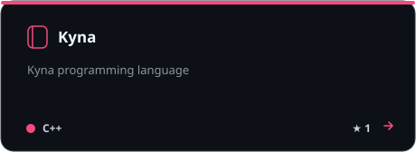
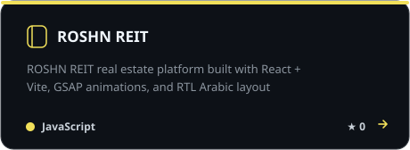
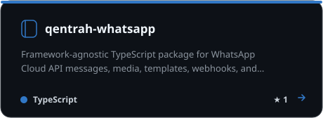
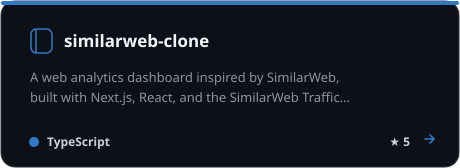
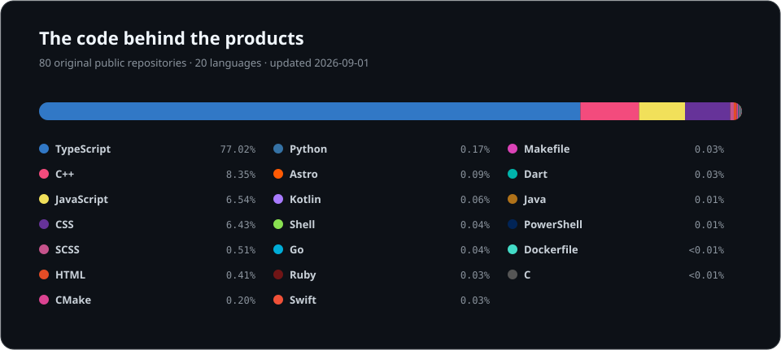

  

  I turn ambitious ideas into useful products — from polished web experiences and APIs 
  to developer tools, AI experiments, and Arabic-first software.

  

## Selected work

<table>
  <tr>
    <td width="50%">
      
    </td>
    <td width="50%">
      
    </td>
  </tr>
  <tr>
    <td width="50%">
      
    </td>
    <td width="50%">
      
    </td>
  </tr>
</table>

## Languages across my work

This chart is rebuilt automatically from every public, original repository I own. Percentages are calculated from the language bytes reported by GitHub.

  

## Contribution trail

<picture>
  <source media="(prefers-color-scheme: dark)" srcset="https://raw.githubusercontent.com/Up-to-code/Up-to-code/output/github-snake-dark.svg" />
  <source media="(prefers-color-scheme: light)" srcset="https://raw.githubusercontent.com/Up-to-code/Up-to-code/output/github-snake.svg" />
  
</picture>

  Building in public, one useful commit at a time.

